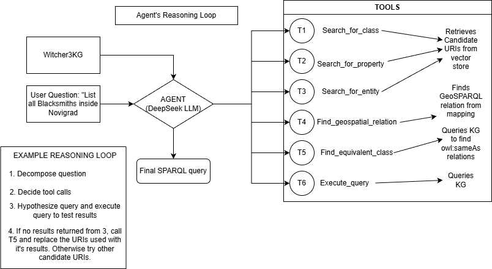

# Integrating Video Games to the Semantic Web: A Q&A System for The Witcher 3

[Integrating Video Games to the Semantic Web - Πέργαμος](https://pergamos.lib.uoa.gr/item/uoadl:5310706) 
[](https://opensource.org/licenses/MIT)

This repository contains the full source code and resources for my thesis "Integrating Video Games to the Semantic Web." It details an end-to-end methodology for constructing a spatially-aware knowledge graph for *The Witcher 3: Wild Hunt* and building a sophisticated, agentic Question-Answering (Q&A) system to query it using natural language.

## Overview

Video game worlds like that of *The Witcher 3* are vast, complex, and rich with interconnected data. However, accessing this information typically requires manually navigating fan wikis. This project addresses that challenge by building a formal, machine-readable Knowledge Graph (KG) and developing an intelligent agent that can translate natural language questions into precise, executable GeoSPARQL queries.

This repository covers the four major phases of the project:
1.  **Knowledge Graph Construction:** Fusing data from wikis, geospatial files, and in-game coordinates.
2.  **Benchmark Development:** Systematically generating a 600-pair benchmark for evaluating NL-to-SPARQL pipelines.
3.  **Information Retrieval:** Building and evaluating a specialized, multi-index vector retrieval system.
4.  **Q&A Pipeline Evaluation:** Comparatively evaluating three different RAG and Agentic architectures.

## System Architecture

The final system is an execution-guided agent (Pipeline C) that uses a multi-index retriever to gather context before iteratively reasoning and self-correcting to generate a final SPARQL query.

 

## Repository Structure

The repository is organized into the following key directories:

── InfoFiles/  
│ ├── novigrad_...json # Raw ArcGIS JSON files for map polygons  
│ └── MapPins.xml # Raw XML file for in-game map pin coordinates  
├── Plots/ # All plots generated for the thesis evaluation  
├── RDF/  
│ ├── Witcher3KG.n3 # The complete Witcher 3 Knowledge Graph  
│ └── classes.ttl # The OWL ontology defining the class hierarchy  
├── Wiki_Dump_Namespaces/  
│ ├── Category.xml # Wiki XML dump for generating the ontology  
│ └── main_namespace.xml # Wiki XML dump for extracting entities and properties  
├── WitcherBenchmark/  
│ ├── validation_set.json # The final validation set (NLQ + SPARQL pairs)  
│ └── test_set.json # The final test set (NLQ + SPARQL pairs)  
├── Python Scripts/  
│ ├── KG/ # Scripts for Knowledge Graph construction  
│ ├── BenchmarkCreation/ # Scripts for generating the benchmark dataset  
│ ├── IndexCreation/ # Scripts for building and evaluating the vector indexes  
│ └── RAGPipelines/ # Scripts for implementing and evaluating the Q&A pipelines  
├── storage/ # (Git-ignored) Saved LlamaIndex vector stores  
├── requirements.txt # Python dependencies for the project  
└── README.md # This file

## Installation

1.  **Clone the repository:**
    ```bash
    git clone https://github.com/argylaz/Witcher3KG.git
    cd Witcher3KG
    ```

2.  **Install dependencies:**
    It is highly recommended to use a virtual environment.
    ```bash
    python -m venv venv
    source venv/bin/activate  # On Windows, use `venv\Scripts\activate`
    pip install -r requirements.txt
    ```

## Usage: Replicating the Project Workflow

The project is designed to be run as a sequential pipeline. After completing the Installation steps, follow the phases below. All core scripts are located in the Python scripts/ directory.

---

### Phase 1: Knowledge Graph Construction

This phase processes all raw data sources (wiki dumps, geospatial files) and generates the final, queryable Knowledge Graph.

Note: NamespaceFilterForWiki.py was run first on the full wiki dump (which is not included in this repository due to its size). The filtered artifacts used by the following scripts are already present in the Wiki_Dump_Namespaces directory.

codeBash

```
# Navigate to the scripts directory 
cd "Python scripts"

# 1. Create the core ontology from category structures
python KG/Category_to_RDF.py
# This produces the Classes.ttl file

# 2. Populate the ontology to create the full knowledge graph
python KG/GraphConstructor.py
# This produces the Witcher3KG.n3 file

# 3. (Optional) Visualize and debug the geospatial data
python KG/geo_debug.py

# 4. From the same directory, run the property definition script
python Define_Properties.py

```

- **Primary Output:** data/main_linked_geo.n3 (The final Knowledge Graph).
    

---

### Phase 2: Benchmark Dataset Development

This phase systematically generates and curates the (SPARQL, Natural Language) benchmark used for all subsequent evaluations.


```
# In the "Python scripts" directory

# 1. Generate a large set of ~4000 valid SPARQL queries and their template-based questions
python DatasetGenerator.py

# 2. Interactively review and hand-pick a high-quality subset (~50 queries) for LLM translation 
# This creates the initial seed for our high-quality natural language questions.
python Select_queries.py

# 3. Use the DeepSeek API to translate the SPARQL of the curated queries into high-quality NLQs
# You will need to provide your API key.
python translate_final_sets.py --api-key "YOUR_DEEPSEEK_API_KEY"

# 4. Assemble the final validation and test sets (~300 queries each)
# This script prioritizes the LLM-translated queries and samples the rest to meet the quota.
python create_benchmark_sets.py
```

- **Primary Outputs:** validation_set.json and test_set.json. These two files form the definitive benchmark for the project.
    

---

### Phase 3: Information Retrieval System (Build & Evaluate)

This phase builds the specialized, multi-index retrieval system using LlamaIndex and evaluates its performance without any LLM reasoning.


```
# In the "Python scripts" directory

# 1. Prepare and enrich the data for indexing
# This script queries the KG and creates descriptive text documents for entities, classes, and properties.
python prepare_data.py

# 2. Build the three persistent vector indexes
# This uses an embedding model to create and save the indexes to the ./storage directory.
python build_indices.py

# 3. Evaluate retrieval performance across different values of k
# This script calculates metrics (MRR, Recall, Precision, F1) for k=1, 3, 5, 10.
python evaluate_retrieval.py

# 4. Generate plots for the retrieval metrics
# This creates the diagrams used in the report (e.g., Recall@k, MRR@k).
python plot_evaluation.py
```

- **Primary Outputs:** The ./storage directory with the vector indexes, retrieval_k_sweep_results.json, and the final plots (recall_at_k_plot.png, etc.).
    

---

### Phase 4: Full Q&A Pipeline Evaluation

This is the final phase, where the LLM-powered pipelines are run and evaluated against the benchmark test set. The pipelines themselves are defined in pipelines.py.


```
# In the "Python scripts" directory

# --- Full Evaluation ---
# 1. Run all pipelines on the entire test set and calculate final metrics (EA and Macro F1)
# This is the main evaluation script for generating the final report numbers.
python evaluate_pipelines.py --api-key "YOUR_DEEPSEEK_API_KEY"

# --- Debugging & Analysis ---
# 2. Test a single query on all pipelines for quick debugging
python test_single_production.py --api-key "YOUR_DEEPSEEK_API_KEY" "Your question here"

# 3. Test a single query and see the full, step-by-step agent conversation log
python test_single_query.py --api-key "YOUR_DEEPSEEK_API_KEY" "Your question here" --pipeline C --log-file agent_log.txt

# 4. Analyze the performance/latency trade-off for the Execution-Guided Agent
# This script tests a few queries at different max_steps values.
python test_step_performance.py --api-key "YOUR_DEEPSEEK_API_KEY"

# 5. Plot the results of the step performance analysis
python plot_performance.py
```

- **Primary Outputs:** pipeline_evaluation_results.json etc. (the main results file) and the performance plots (step_accuracy_plot.png, etc.).
